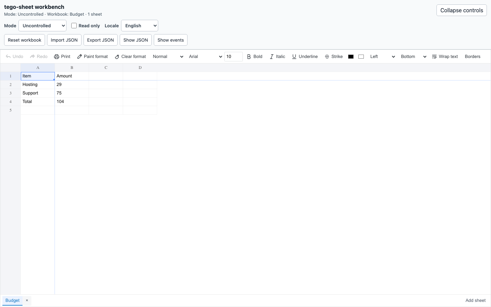

# tego-sheet

`tego-sheet` is a React, TypeScript, and Canvas spreadsheet component built around one versioned `SpreadsheetDocument` model.



## Install

```sh
npm install tego-sheet react react-dom
```

Import the component and its explicitly exported stylesheet:

```tsx
import { createSpreadsheetDocument, TegoSheet } from 'tego-sheet';
import 'tego-sheet/styles.css';

export function Workbook() {
  return <TegoSheet defaultDocument={createSpreadsheetDocument()} />;
}
```

## Uncontrolled and controlled workbooks

`defaultDocument` initializes an uncontrolled document. The component then owns edits; `onDocumentChange` receives an isolated schema 2 snapshot and typed change metadata.

```tsx
import { createSpreadsheetDocument, TegoSheet } from 'tego-sheet';

const initial = createSpreadsheetDocument({ sheetName: 'Budget' });

export function Uncontrolled() {
  return (
    <TegoSheet
      defaultDocument={initial}
      onDocumentChange={(next, change) => {
        console.log(change.kind, next);
      }}
    />
  );
}
```

Use `document` when the parent owns the accepted snapshot. Keep the same reference for unrelated renders; supply a new document to accept, reject, or replace optimistic edits.

```tsx
import { useState } from 'react';
import { createSpreadsheetDocument, TegoSheet } from 'tego-sheet';

export function Controlled() {
  const [document, setDocument] = useState(() => createSpreadsheetDocument());
  return <TegoSheet document={document} onDocumentChange={setDocument} />;
}
```

Do not pass both `document` and `defaultDocument`, and do not switch modes after mount.

## Callbacks and ref commands

The public callbacks are `onDocumentChange`, `onActiveSheetChange`, `onSelectionChange`, `onCellEdit`, `onPaste`, and `onError`.

`TegoSheetHandle` exposes `focus`, `getDocument`, `getCell`, `getCellStyle`, `setCellText`, sheet add/delete/rename/activate commands, `undo`, `redo`, `validate`, `print`, and `recalculateLayout`.

```tsx
import { useRef } from 'react';
import { createSpreadsheetDocument, TegoSheet, type TegoSheetHandle } from 'tego-sheet';

export function WithRef() {
  const sheet = useRef<TegoSheetHandle>(null);
  return (
    <>
      <button onClick={() => sheet.current?.undo()}>Undo</button>
      <TegoSheet
        ref={sheet}
        defaultDocument={createSpreadsheetDocument()}
        onCellEdit={(event) => console.log(event.text)}
      />
    </>
  );
}
```

## Toolbar and sheet-tab slots

Set `toolbar` or `sheetTabs` to `false` to hide that region, use the default by omitting the prop, or pass a typed renderer. Slot renderers receive a read-only view model and typed actions, never implementation objects.

```tsx
import { createSpreadsheetDocument, TegoSheet, type ToolbarRenderer } from 'tego-sheet';

const toolbar: ToolbarRenderer = (state) => (
  <button disabled={!state.canUndo} onClick={() => state.execute({ type: 'undo' })}>
    Undo
  </button>
);

export function CustomChrome() {
  return (
    <TegoSheet defaultDocument={createSpreadsheetDocument()} toolbar={toolbar} sheetTabs={false} />
  );
}
```

## Locales

Locales are isolated per component. Import only the dictionary you use; English remains the recursive fallback for partial custom messages.

```tsx
import { createSpreadsheetDocument, TegoSheet } from 'tego-sheet';
import { zhCN } from 'tego-sheet/locales/zh-cn';

export function ChineseWorkbook() {
  return <TegoSheet defaultDocument={createSpreadsheetDocument()} locale={zhCN} />;
}
```

The public locale subpaths are `tego-sheet/locales/en`, `/de`, `/nl`, and `/zh-cn`. No aggregate locale entry or internal source subpath is public.

## Legacy workbook JSON

Existing sparse workbook JSON must enter explicitly through `migrateLegacyWorkbook`. Pass the successful schema 2 result through `document` or `defaultDocument`; all runtime snapshots remain `SpreadsheetDocument`.

See [Migration from x-data-spreadsheet](docs/migration-from-x-data-spreadsheet.md) for option mappings, the five intentional correctness fixes, and removal of the old imperative API.

Existing tego-sheet applications moving from mutable workbook JSON should use
[Migration to Workbook 2.0](docs/migration-to-workbook-2.md).

## Optional public entry points

- `tego-sheet/interchange`: bounded CSV, TSV, XLSX, and ODS readers and writers.
- `tego-sheet/output/pdf`, `/xlsx`, and `/image`: isolated generated-document adapters.
- `tego-sheet/sdk`: custom cells, template modules, adapter lifecycle, trust, and capabilities.
- `tego-sheet/integrations`: host-owned persistence, history, collaboration, permission, comments, and AI proposal protocols.

## Documentation

- [Documentation](https://sealday.github.io/tego-sheet/docs/getting-started/installation)
- [API Reference](https://sealday.github.io/tego-sheet/docs/api)
- [Playground](https://sealday.github.io/tego-sheet/playground)

## Ownership and upstream attribution

Tego Sheet is maintained by [sealday](https://github.com/sealday). Its React API, TypeScript architecture, component lifecycle, and the modifications in this repository are owned by sealday under the MIT License.

The spreadsheet interaction design, supported workbook JSON format, feature behavior, compatibility goals, and portions of compatibility logic and locale content were adapted from [x-data-spreadsheet](https://github.com/myliang/x-spreadsheet), also under the MIT License. Tego Sheet does not bundle or depend on the upstream JavaScript runtime, but it is not presented as a clean-room implementation. The original `myliang` copyright notice is retained in [LICENSE](LICENSE).

Tego Sheet is a separate project and is not affiliated with or endorsed by the upstream project. Third-party assets that carry their own notices remain subject to their respective licenses.
